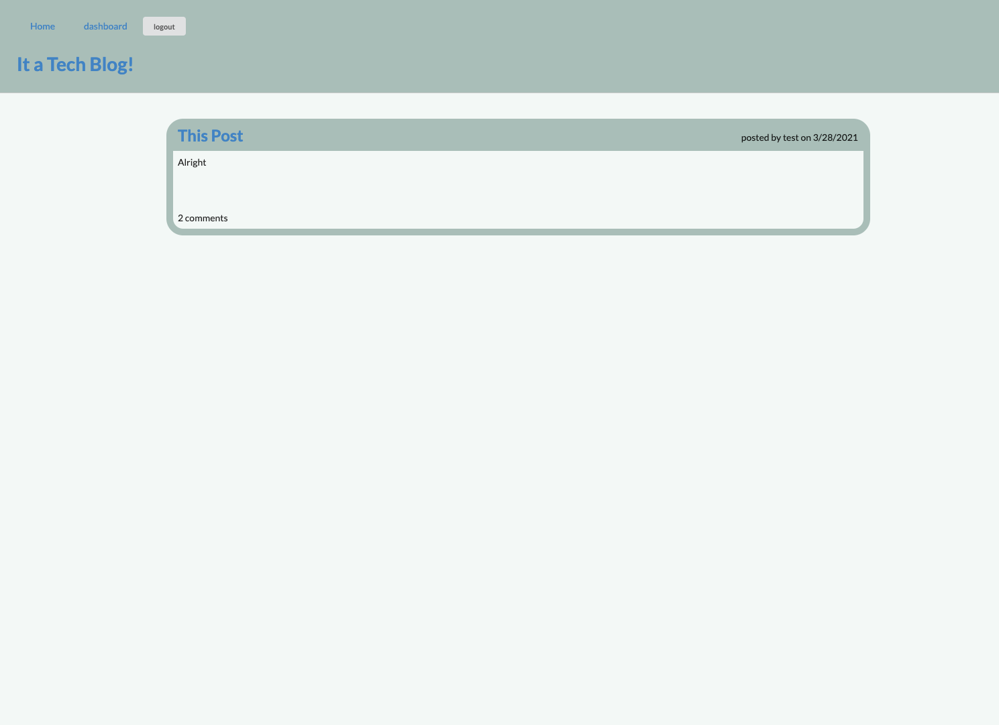

 # TechBlog Plus
   

  
  
  ### Table of Contents
  * [Description](#project-description)
  * [Installation](#installation)
  * [Usage](#usage)
  * [Contribution](#contributions)
  * [Tests](#tests)
  * [Questions](#questions)
  * [License](#license)
  
  ### Project Description
  a handy blog to discuss tech and tech adjacent topics.

  ### Contributions
  Contributions are welcome!

  ### Questions
  wfh2d88@gmail.com   

  https://github.com/william-hunt88

  https://github.com/william-hunt88/Module14-TechBlog
  
  
  Licensed under the [MIT](https://github.com/william-hunt88/Module14-TechBlog/blob/main/LICENSE.txt) license
